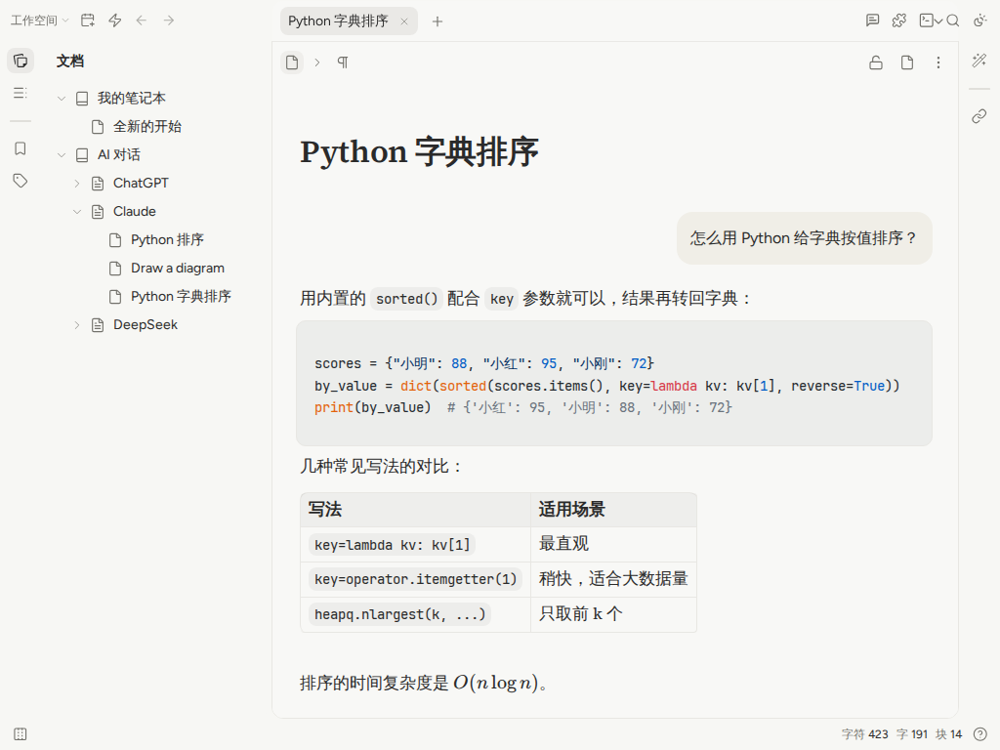
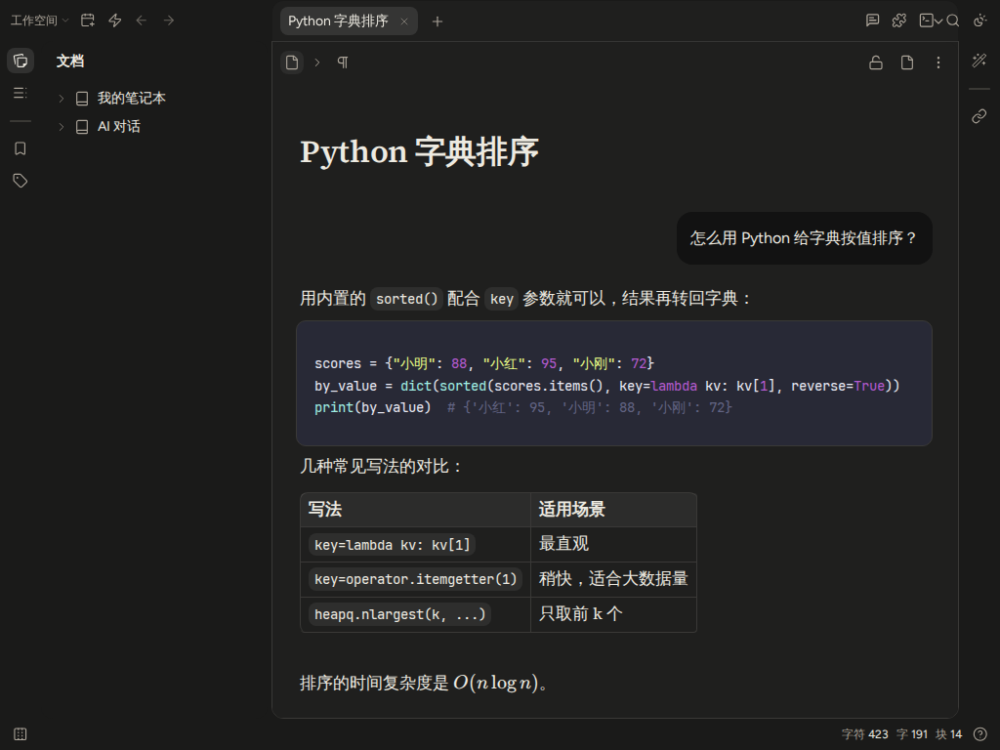

# 思源笔记 · Claude 风格 + AI 对话笔记

这个目录让 [思源笔记（SiYuan）](https://github.com/siyuan-note/siyuan) 变成一个「AI 对话笔记本」：

- **功能用思源**：块编辑、双链、搜索、数据库、导出等全部保留，不修改思源源码，可以随官方版本升级
- **界面用 .ai 前端的风格**：主题 `claude-style`，暖白配色、Figtree / Source Serif 字体、圆角，支持明亮和暗黑模式
- **Claude 网页对话原生显示**：插件 `ai-chat-notes`，在 claude.ai 等网页复制的对话粘贴后自动分成「提问 / 回答」，提问是右侧暖色气泡，回答是衬线正文，代码块、表格、公式都保留
- **本地管理、去云端**：笔记只保存在你指定的本地目录；插件默认关闭云端同步和更新包自动下载，并隐藏云端入口
- **跨平台导入本地聊天记录**：Claude / ChatGPT / DeepSeek 官方导出的 zip 或 json、Markdown、TXT、网页另存为的 HTML

| 明亮模式 | 暗黑模式 |
| --- | --- |
|  |  |

## 目录结构

```
siyuan/
├── install.mjs              一键安装主题和插件到思源工作空间
├── docker-compose.yml       Docker 部署（浏览器使用）
├── .env.example             Docker 配置：存储目录、访问授权码、端口
├── themes/claude-style/     主题（可直接复制安装）
├── plugins/ai-chat-notes/   插件构建产物（可直接复制安装）
└── plugin-src/              插件源码、测试和构建脚本
```

## 安装

需要思源 3.8 或更高版本，以及 Node.js 18+（只用于运行安装脚本）。

### 方式一：桌面版（Windows / macOS / Linux）

1. 从 [思源官网](https://b3log.org/siyuan/download.html) 或 [GitHub Releases](https://github.com/siyuan-note/siyuan/releases) 下载安装思源。首次启动时选择笔记存储目录（即「工作空间」，可以是任意本地目录）
2. 保持思源运行，在本目录执行：

   ```bash
   node install.mjs <工作空间目录> --enable
   ```

   例如 `node install.mjs ~/SiYuan --enable` 或 `node install.mjs D:\Notes --enable`。脚本会复制主题和插件、在 设置 - 集市 中信任第三方插件、启用插件，并把明亮 / 暗黑模式主题都切换为「Claude 风格」
3. 刷新思源界面（`F5` 或重启）

### 方式二：Docker（浏览器使用）

1. 准备配置并启动：

   ```bash
   cp .env.example .env          # 修改 SIYUAN_WORKSPACE（存储目录）和 SIYUAN_ACCESS_AUTH_CODE（访问授权码）
   docker compose up -d
   ```

2. 浏览器打开 <http://127.0.0.1:6806>（只对本机开放），输入访问授权码，在 设置 - 鉴权 中复制 API token
3. 安装并启用（`./workspace` 换成 `.env` 中 `SIYUAN_WORKSPACE` 的实际路径）：

   ```bash
   node install.mjs ./workspace --enable --token <API token>
   ```

4. 刷新页面

### 手动安装

| 复制 | 到 |
| --- | --- |
| `themes/claude-style/` | `<工作空间>/conf/appearance/themes/claude-style/` |
| `plugins/ai-chat-notes/` | `<工作空间>/data/plugins/ai-chat-notes/` |

重启思源后：设置 - 集市 中确认信任第三方插件，设置 - 集市 - 已下载 - 插件 中启用「AI 对话笔记」，设置 - 外观 中把明亮和暗黑模式的主题都选为「Claude 风格」。

## 使用

### 粘贴网页对话

在 AI 网页上选中对话（可以连续选多轮）复制，回到思源文档里直接 `Ctrl+V` / `⌘V`：

| 网站 | 识别方式 |
| --- | --- |
| Claude（claude.ai） | 网页结构：`data-testid="user-message"`、`.font-claude-response` |
| ChatGPT | 网页结构：`data-message-author-role` |
| Gemini | 网页结构：`<user-query>`、`<model-response>` |
| Kimi、豆包 | 网页结构 |
| DeepSeek | 回答的 `.ds-markdown`，回答之间的文字作为提问 |
| 其他 | 文本中的说话人标签：`You said:`、`User:`、`Assistant:`、`Human:`、`Claude:`、`用户：`、`我：`、`问：`、`答：` 等 |

没有识别到对话时保持思源原来的粘贴行为。只复制了一段回答时，用命令面板（`Alt+Shift+P`）中的「以对话格式粘贴」；也可以在块标菜单 插件 - 对话样式 中把任意块设为提问 / 回答 / 思考过程。

### 导入本地聊天记录

点击顶栏右侧的对话图标（或命令面板「导入聊天记录」），选择或拖入文件，勾选要导入的对话后点「导入」：

| 来源 | 如何得到文件 |
| --- | --- |
| Claude | claude.ai：Settings - Privacy - Export data，邮件中下载的 `.zip` |
| ChatGPT | Settings - Data controls - Export data，邮件中下载的 `.zip` |
| DeepSeek | 网页版导出的 `conversations.json` |
| 通用 JSON | `[{ "role": "user", "content": "..." }, ...]` 或 `{ "title": "...", "messages": [...] }` |
| Markdown / TXT | 带说话人标签的文本，包括 `.ai` 前端导出的「## 用户 (User)」格式 |
| HTML | 在对话页面按 `Ctrl+S` 另存的网页 |

每个对话一篇文档，路径为 `AI 对话/<来源>/<标题>`；重复导入会跳过已经导入过的对话（按文档属性 `custom-chat-id` 判断）。

## 本地存储与去云端

- 所有笔记都保存在工作空间目录中（`data/` 下的 `.sy` 文件和 `data/assets/` 附件），备份时直接复制整个目录即可
- 更换存储目录：桌面版 左上角主菜单 - 工作空间 - 新建 / 打开；Docker 修改 `.env` 的 `SIYUAN_WORKSPACE`
- 插件的「本地模式」（默认开启）会关闭云端同步和更新包自动下载，并隐藏顶栏同步按钮、订阅入口和欢迎卡片中的「登录并同步」；插件设置中会显示当前存储目录
- 「去云端」是通过关闭功能和隐藏入口实现的，没有删除思源源码中的云端代码；思源内核仍会定期请求官方服务器获取版本信息（不包含笔记内容），如需完全离线可以用系统防火墙阻止思源联网

## 开发

```bash
cd plugin-src
npm install
npm test                 # 解析与渲染的单元测试
npm run typecheck
npm run build            # 输出到 ../plugins/ai-chat-notes/
```

设置环境变量 `LUTE_PATH` 指向思源安装目录中的 `resources/stage/protyle/js/lute/lute.min.js` 后，测试会使用思源真实的 Markdown 引擎检查 HTML 转换和块属性。各网站的识别规则集中在 `plugin-src/src/parse/html.ts` 的 `SITE_RULES`，网站改版时修改这里即可。

## 已知限制

- 各网站的网页结构是按目前已知的 DOM 编写的，本仓库的测试使用仿照这些结构的样例，无法登录真实网站验证；网站改版后可能需要更新 `SITE_RULES`，此时仍可通过说话人标签或块标菜单手动调整
- DeepSeek 网页的思考过程靠类名中包含 `think` 识别；DeepSeek 导出文件格式为尽力兼容
- ChatGPT 导出包中的图片暂时只显示为「[图片]」占位，不会导入为附件

## 许可

主题和插件沿用本仓库根目录的 [LICENSE](../LICENSE)（非商业许可）。主题中的字体使用 SIL Open Font License 1.1。思源笔记本身使用 AGPL-3.0，本目录只通过其主题和插件接口工作，不包含思源源码。
